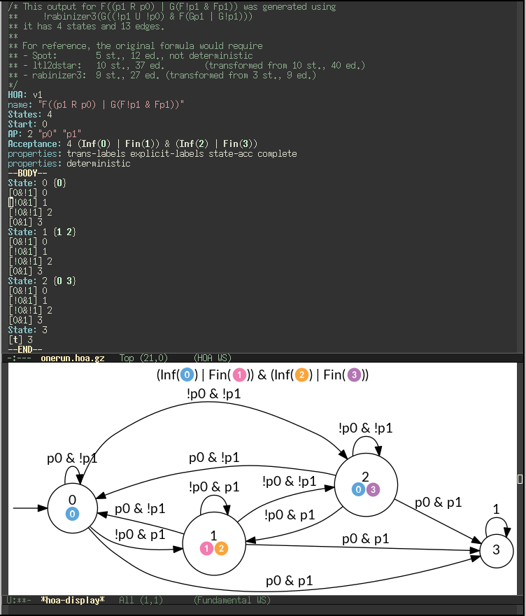

# `hoa-mode.el` [](http://melpa.org/#/hoa-mode)

A major mode for editing automata in the [Hanoi Omega Automata
format](http://adl.github.io/hoaf/).

Offers syntax-highlighting, navigation in a file with multiple
automata, and visualization.



## Installation

You can either install from MELPA, or from Git.

To install from MELPA, first configure your emacs to use MELPA:

```lisp
(require 'package) ; This is part of Emacs 24
(unless (assoc-default "melpa" package-archives)
   (add-to-list 'package-archives '("melpa" . "http://melpa.org/packages/") t))
(package-initialize)
```

Once that is done, you can install `hoa-mode` is many ways.  For
instance interactively by running `M-x package-list-packages`, moving
to `hoa-mode`, pressing `i` (for install), and `x` (for execute).  Or
you can also do `M-x package-install` and then just enter `hoa-mode`.
Or you could also use a system like
[`use-package`](https://github.com/jwiegley/use-package) in your
config file.

To install from git, first checkout the git repository somewhere

```sh
git clone https://gitlab.lrde.epita.fr/spot/emacs-modes.git
```

Then tell your emacs about it:

```lisp
(add-to-list 'load-path "/path/to/emacs-modes/")
(require 'hoa-mode)
```

Using emacs' package system is better if you depend on a lot of
third-party packages.


## Usage


- If the cursor is on an automaton in the HOA format, type `C-c C-c`
  to display the automaton at point.  This calls
  [`autfilt`](https://spot.lrde.epita.fr/autfilt.html) and
  [`dot`](http://www.graphviz.org/) for rendering.  The command used
  may be altered using `C-u C-c C-c` or by setting the
  `hoa-display-command` variable.

- `M-a` and `M-e` are bound respectively to `hoa-start-of-automaton` and
  `hoa-end-of-automaton` and may be used to move into long list of automata.
  They do not update the displayed automaton (if any).

- `M-<up>` and `M-<down>` are bound respectively to `hoa-previous-automaton` and
  `hoa-next-automaton`.  They behave similarly, but will also update the displayed
   automaton if one is displayed (so you should call `C-c C-c` first).

- `C-M-h` is bound to `hoa-mark-automaton-at-point`.
